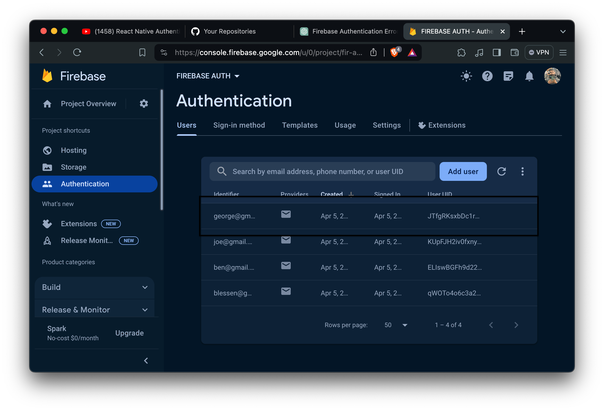

#  FIREBASE-AUTHENTICATION 🔐
 
 Firebase Authentication is a service provided by Google's Firebase platform that enables developers to easily add user authentication to their mobile and web applications. It offers a secure and reliable way to authenticate users, allowing them to sign up, sign in, and manage their accounts.

## Overview

## FIREBASE BACK-END CONSOLE 💻

## 🔗 Links

